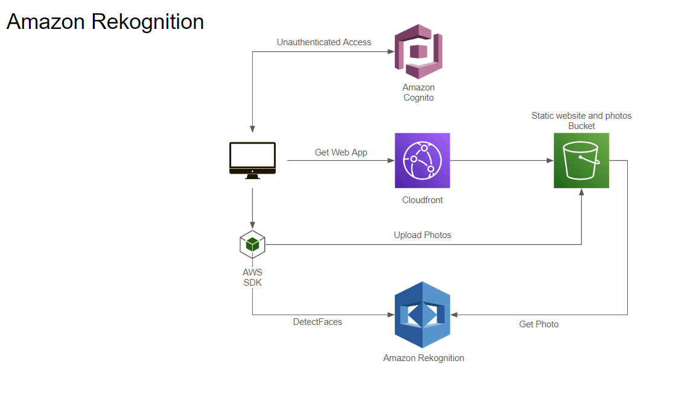

# Project Title

AWS AI service name AWS Rekognition for face detection.

# Architectural Image


# Setup aws S3 bucket

Used to store uploaded photos (images) from the user's (browsers) web cam.

The name and region will be used in the `script.js` code.

# Setup aws cognito

Used to get access to aws resources.

The IdentityPoolId setup below will also be used in the `script.js` code.

> Amazon Cognito provides solutions to control access to AWS resources from your app.

The service is found under 'Security, Identify, & Compliance'


1. Click cognito service in aws console
2. Click "Managed Federated Identies" button
3. Enable "Enable access to unauthenticted identities"
4. Click "create pool" button

The next screen has details which show this will setup the following roles for authenticated identities

The Role Name is Cognito_codeacademyrekAuth_Role

The Policy Document is

```
{
  "Version": "2012-10-17",
  "Statement": [
    {
      "Effect": "Allow",
      "Action": [
        "mobileanalytics:PutEvents",
        "cognito-sync:*",
        "cognito-identity:*"
      ],
      "Resource": [
        "*"
      ]
    }
  ]
}
```


The next screen has details which show this will setup the following roles for unauthenticated identities

The Role Name is Cognito_codeacademyrekUnauth_Role

The Policy Document is

```
{
  "Version": "2012-10-17",
  "Statement": [
    {
      "Effect": "Allow",
      "Action": [
        "mobileanalytics:PutEvents",
        "cognito-sync:*"
      ],
      "Resource": [
        "*"
      ]
    }
  ]
}

The difference is in the "cognito-identity" entry.
```


5. Click "Allow" button

This shows the "Getting started with Amazon Cognito" screen.  It has AWS SDKs for various platforms.

6.  Get the "Identity pool ID" in the first stanza identified as "Get AWS Credentials".  Copy the string associated with the comment `// Identity pool ID`.
As an example:

```
"us-east-1:44456c50-199b-4fe8-8ec5-8337b329051b", // Identity pool ID
```

Paste this code in the javascript code script.js for the variable `IdentityPoolId`

# Deploying the web app

## Update the web app
Once the three variables in script.js are set.  Zip the code and upload.

```
~/aws-machinelearning/rekognition/demo-sdk$ zip -r web.zip .
```

## Create a static web page

NOTE: At this point, the video shows how to host a static web app using quick start, but it is no longer on the aws console.  Instead it has been replaced with [AWS Amplify](https://aws.amazon.com/amplify/).  These instructions focus on Amplify.  Separate instructions are available elsewhere for integrating Amplify, Static hosts and Elastic Beanstalk.

1. Click the 'aws' icon in top left
2. Scroll down to `Build a solution` tile at bottom of page
3. Click the `Host a static web ` with AWS Amplify Console.  
4. Click "Deploy without git provider"
5. Give name "CloudAcademyRekognitionWebApp"
6. upload the `web.zip` created earlier.
7. Note the Domain, in this case `https://test.d360yg3fm3vqo1.amplifyapp.com/`


### Update S3 bucket

1. Open `S3` to `cloudacademy-rek` bucket
2. Click `Permissions`
3. Scroll down to the empty `Cross-origin resource sharing (CORS)` section
4. Open in a new tab the `Learn more` link.
5. In the next page, open in a new tab the example `CORS configuration`
6. Scroll down to the `Example 1` section and click the `JSON` tab.
7. Copy the text from the example and modify or use this:
>
```
[
    {
        "AllowedHeaders": [
            "*"
        ],
        "AllowedMethods": [
            "PUT",
            "POST",
            "DELETE"
        ],
        "AllowedOrigins": [
            "https://rek-face.rtp-aws.org"
        ],
        "ExposeHeaders": []
    },
    {
        "AllowedHeaders": [],
        "AllowedMethods": [
            "GET"
        ],
        "AllowedOrigins": [
            "*"
        ],
        "ExposeHeaders": []
    }
]
```
8. NOTE: the video shows XML, but XML no longer works. re. `The CORS configuration, written in JSON, defines a way for client web applications that are loaded in one domain to interact with resources in a different domain. `
9. Go back to the S3 CORS section. Click the `Edit` button and paste the above in the edit box.
11. Click save.

### Update IAM Roles

1. Navigate to `IAM`
2. Click `Roles`
3. Search for `Cog` and then select `Cognito_codeacademyrekUnauth_Role`
4. Click and then search for `S3`
5. Click checkbox for `AmazonS3FullAccess`.  The video mentions this is for demo purposes only.
6. Likewise add `Rekognition`, specify `DetectFaces`, name it `codeacadameyrecognitiondetectfaces_policy`
9. Click `Roles`, click `Cognitio_codeacademyrekUnauth_Role`
10. Click attach policy
11. search for `code`, select `codeacadameyrecognitiondetectfaces_policy` and then click `attach policy`
12. Navigate back to the S3 bucket  and then modify the `Bucket policy` to
>
```
{
    "Version": "2012-10-17",
    "Id": "S3-Console-Auto-Gen-Policy-1642895940237",
    "Statement": [
        {
            "Sid": "S3PolicyStmt-DO-NOT-MODIFY-1642895940033",
            "Effect": "Allow",
            "Principal": {
                "Service": "logging.s3.amazonaws.com"
            },
            "Action": [
                "s3:GetObject",
                "s3:PutObject",
                "s3:PutObjectAcl"
            ],
            "Resource": "arn:aws:s3:::cloudacademy-rek/*"
        }
    ]
}
```
